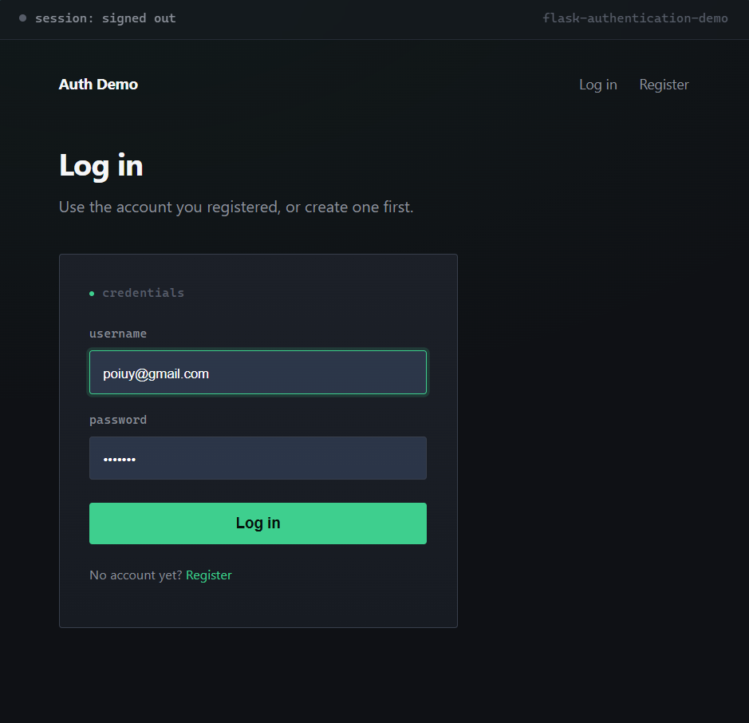
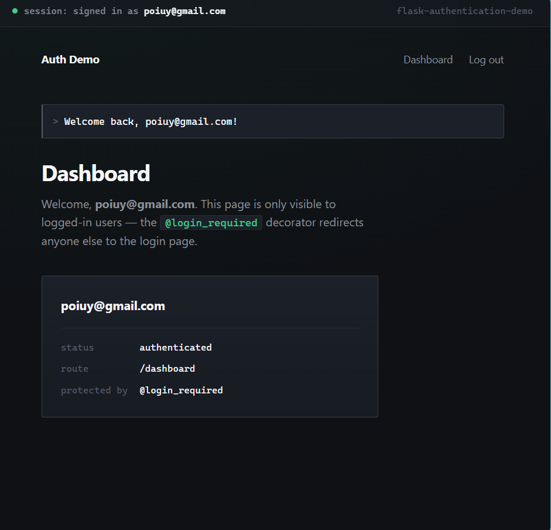
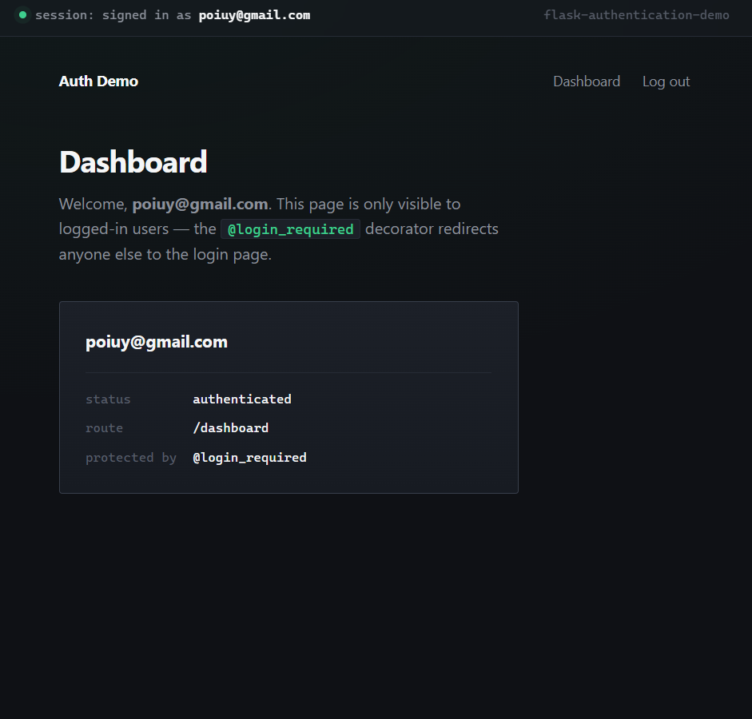

# Flask Authentication Demo


A working login/authentication system built with Flask: user registration, hashed passwords, session-based login, route protection, and a small protected dashboard — with a custom dark UI designed to make the app's session/auth state visible at a glance.

## Features
- User registration with duplicate-username checking
- Passwords hashed with Werkzeug's `generate_password_hash` / `check_password_hash` (never stored in plaintext)
- Session-based login (`flask.session`)
- `@login_required` decorator protecting routes from unauthenticated access
- Organised using Flask **blueprints** (`auth` and `main`) instead of one flat file
- SQLite storage (zero setup required)
- Custom UI with a live session-status indicator, so you can see the auth state change in real time as you log in/out

## Tech Stack
- Python, Flask
- SQLite (via `sqlite3`)
- Jinja2 templates
- Hand-written CSS (no framework)

## Project Structure
```
.
├── run.py
├── requirements.txt
├── test_auth_flow.py       # Automated end-to-end test of the real auth flow
└── app/
    ├── __init__.py          # App factory
    ├── db.py                 # SQLite connection + schema
    ├── auth/                 # Blueprint: register, login, logout, login_required
    │   ├── __init__.py
    │   └── routes.py
    ├── main/                 # Blueprint: home + protected dashboard
    │   ├── __init__.py
    │   └── routes.py
    ├── static/
    │   └── style.css         # UI styling
    └── templates/
        ├── base.html
        ├── index.html
        ├── dashboard.html
        └── auth/
            ├── login.html
            └── register.html
```

## Getting Started

### Prerequisites
- Python 3.10+

### Install
```bash
git clone https://github.com/<your-username>/flask-authentication-demo.git
cd flask-authentication-demo
python -m venv venv
venv\Scripts\activate        # Windows
source venv/bin/activate     # macOS/Linux
pip install -r requirements.txt
```

### Run
```bash
python run.py
```
Then open **http://localhost:5000** — register an account, log in, and visit `/dashboard` (try visiting it while logged out to see the redirect). Watch the status bar at the top of the page — it reflects your real session state.

### Run the automated test
```bash
python test_auth_flow.py
```
This exercises the real flow with Flask's test client: registration, duplicate-username rejection, wrong-password rejection, successful login, protected-route access, logout, and confirms passwords are actually hashed in the database rather than stored as plaintext.

## Screenshots




## What This Demonstrates
- A complete, realistic authentication flow rather than a toy example
- Practical use of password hashing and session security basics
- Structuring a Flask app with blueprints for maintainability as it grows
- Writing an automated test against real app behaviour, not just manual clicking
- Designing a UI where visual state (the session indicator) reflects real backend state, not just static styling

## Possible Next Steps
- Add password reset via email
- Add role-based access control (admin vs regular user)
- Move from SQLite to MySQL/PostgreSQL for production use
- Add rate limiting on login attempts

## License
This project is licensed under the MIT License — see the [LICENSE](LICENSE) file for details.